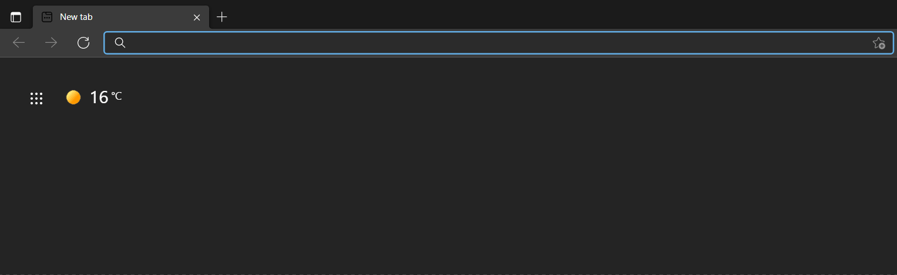

# Omnibang

Omnibang is probably the fastest chromium extension for [DuckDuckGo bangs](https://duckduckgo.com/bang). It doesn't rely on redirects, but instead sends you directly to your desired website. All processing is handled client side. 



It is based on [elboza's "bang-chrome-extension"](https://github.com/elboza/bang-chrome-extension). Without him, this extension wouldn't be possible. 

## Usage
```
! {abbreviation} {search term}
```
> NOTE: Make sure to put a space or press tab after the exclamation mark!

For example:
```
! yt wintergatan
```

## Installation
I'm planning on publishing the extension on the chrome web store. As of now, though, you'll have to install the extension manually. 
1) [Download](https://github.com/v0iden/omnibang/archive/refs/heads/master.zip) zip file from Github. Extract to a location where it won't be deleted.
2) Open the Extension Management page by navigating to `chrome://extensions`.
3) Enable Developer Mode by clicking the toggle switch (upper right corner for Chrome, lower left corner for Edge).
4) Click the *Load unpacked* button and select the extension directory.

## Benefits
I previously used a bang chrome extension that was really slow. Here's how it worked:

1) I typed in a `!bang` in the search bar. 
2) I would then be sent to `google.com/search?q=!bang`
3) The extension would analyze the url and determine if I had typed in a bang. 
4) If I had, it would then redirect me to `duckduckgo.com/?q=!bang`
5) Finally, DuckDuckGo itself would redirect me to my desired website. 

As you can imagine, this took a lot of time. In comparison, here's how my extension works:

1) You type in a `! bang` in the search bar.
2) The extension looks at the bang and compares it to a **local** database of bangs. 
3) If there's a match, you'll get sent directly to your desired website. 
4) If the abbreviation isn't found, you will instead get a normal google search. 

## Bugs
This extension is really [bodged](https://youtu.be/lIFE7h3m40U) together, so there might be bugs. Please let me know if you find any. 

## Author

- [Original extension](https://github.com/elboza/bang-chrome-extension) by Fernando Iazeolla. Copyright 2014. 
- Edited and updated by v0iden. Copyright 2021.

## License
This software is distrubuted under the [GPLv2](license.md) license.
